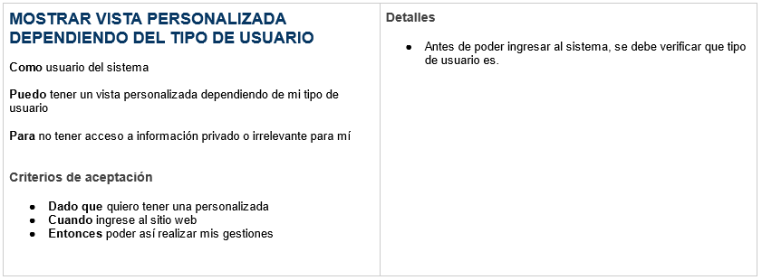

## METODOLOGÍA DE DESARROLLO A UTILIZAR
La metodología a utilizar sera **scrum**, la cual se basa en una gestión de proyectos evolutiva que trata de adquirir una técnia de desarrollo incremental interativa, donde después de un período corto de tiempo (sprint) se entregará al cliente un resultado funcional (incremento).

Scrum se basa en cinco valores:
1. Coraje: Para mostrarnos vulnerables y pedir ayuda para resolver los impedimentos que surgan.
2. Foco: Enfocarse en alcanzar los objetivos de cada sprint y centrar en hacer una cosa a la vez.
3. Compromiso: Que cada miembro este comprometido a alcanzar los objetivos y a hacer el máximo esfuerzo posible.
4. Respeto: Para poder trabjar en equipo, y tener confianza con los demás para dar y recibir feedback.
5. Apertura: transaprecia, sinceridad y franquesa.

Se decidió utilizar scrum debido a que es una metodología ágil que se adapta muy bien para el desarrollo de software, es una de las metodologías más utilizadas en el mercado laboral, y se adapta de muy buena manera al equipo de trabajo, debido a que no se cuenta con una jerarquía dentro el grupo de trabajo.

## MÉTODO DE BRANCHING A UTILIZAR

El método de branching a utilizar sera **gitflow**, el cual es un modelo alternativo de creación de ramas de Git en el que se utilizan ramas de función y varias ramas principales.
Ramas principales:
- Ramas master/main: Contiene cada una de las versiones estables del proyecto.
- Rama develop: Contiene el código de desarrollo de la siguiente versión planificada del proyecto. En ella se incluirán cada una de las nuevas características que se desarrollen.

Ramas de apoyo:
- Ramas feature: Estas ramas surgen de la rama develop. Cada una de estas ramas almacenan código de desarrollo con nuevas características. Una vez terminado su desarrollo, se incorporán nuevamente a la rama develop, que contendrá la última versión de código en desarrollo.
- Ramas release: Estas ramas surgen de la rama develop. Contienen el código de la versión que se va a liberar próximamente. Es un paso previo y preparatorio para la versión definitiva de producción. En ella se incluye todo el código de develop necesario para el lanzamiento. Una vez finalizada la rama, esta se incluye en la rama develop y en la master/main.
- Ramas hotfix: Surgen de la ramas master. Contienen una versión de producción con un error que se desea arreglar urgentemente. Una vez arreglado el error, se incluye el contenido de esta rama en las ramas master y develop para subsanar el error. Además, se marca la versión arreglada en producción con un tag en la rama master.

Se utilizará gitflow debido a que el proyecto se trabajará en equipo, y con esa estrategia se logrará mejorar la organización de branchs dentro del repositorio y, de esta forma, dar más fluidez al proceso de nuevos features y releases. 

## TECNOLOGÍAS A UTILIZAR
Las tecnologías que se utilizarán sera el stack **MERN**, este conjunto de tecnologías incluye:

**Mongo DB**
Es una base dedatos NoSQL orientada a documentos y multiplataforma, que almacena los datos en formato JSON.

**Express**
Es un framework alojado dentro del entorno de ejecuión NodeJS que ayuda a desarrollar aplicaciones web y crear APIs. Diseñado para escribir aplicaciones simplificadas, rápidas y seguras, del lado del servidor (back-end).

**React**
Es una biblioteca de JavaScript de código abierto, utilizada para desarrollar interfaces de usuario (front-end).

**NodeJS**
Es un entorno de ejecución de JavaScript y multiplataforma para desarrollar aplicaciones de servidor. Orientado a eventos asíncronos y diseñado para crear aplicaciones escalables (back-end).

## HISTORIAS DE USUARIO

[comment]: <> (Raul agrega aca tus historias)

## SEGURIDAD DE LA APLICACIÓN
Para garantizar la privacidad de la información de los usuarios, las contraseñas se guardarán encriptadas en la base de datos para lo cual se utilizará la librería **bcrypt** de NodeJS, antes de ingresar a la aplicación se verificará que tipo de usuario intententa tener acceso, para así poder mostrar una vista de acuerdo a los permisos que este posee. 

Para los endpoints que se utilizarán en la API REST se implementará JWT **(JSON Web Tokens)**, para brindar autentifiación de usuarios mediante tokens para poder obtener acceso a los recursos de los endpoints. De esta manera para que el usuario pueda obtener acceso a los datos del servidor, deberá enviar un token como forma de autentificación.

También se realizarán pruebas unitarias y pruebas de integración para poder detectar cualquier tipo de error o vulnerabilidad que pueda ser explotada. Para proteger el sistema de vulnerabilidades conocidas se utilizará **Helmet**, mediante el cual se protegerán los encabezados HTTP.

## ARQUITECTURA DEL SISTEMA

### DIAGRAMA DE COMPONENTES

### DIAGRAMA DE DESPLIEGUE

## CASOS DE USO

## MOCKUPS PRINCIPALES

